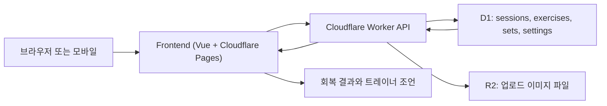

# 초급자용 입문 가이드 (Cloudflare 운영 경로)

## 대상과 범위
- 대상: 프로그래밍 비전공자, 또는 웹/백엔드 초급 개발자
- 범위: 현재 운영 경로인 `frontend` + `cloudflare-api` + `D1/R2`
- 제외: `backend`는 레거시 참고용이며 운영 경로가 아님

## 1) 이 프로젝트를 한 문장으로
한 줄 결론: 운동 스크린샷과 OCR 텍스트를 받아서, 운동 기록을 구조화하고 근육별 회복 상태를 설명 가능한 형태로 보여주는 서비스입니다.

상세:
- 사용자는 화면에서 스크린샷을 올리고 OCR을 실행합니다.
- 서버는 텍스트를 파싱해 `세션/운동/세트` 데이터로 저장합니다.
- 저장된 운동량을 바탕으로 근육별 피로/회복을 계산해 추천 메시지를 제공합니다.

## 2) 30초 전체 흐름 (사용자 행동 기준)
한 줄 결론: `Upload -> Sessions -> Recovery` 순서로 보면 전체를 가장 빠르게 이해할 수 있습니다.

1. 사용자가 `Upload` 화면에서 이미지를 선택하고 `Run OCR` 실행
2. 필요하면 `AI 정리`로 OCR 텍스트를 정규 포맷으로 변환
3. `Upload` 버튼으로 `POST /api/uploads` 호출
4. 서버가 세션/운동/세트를 D1에 저장하고 업로드 파일은 R2에 저장
5. `Sessions` 화면에서 기록 확인/수정/복제/삭제
6. `Recovery` 화면에서 근육별 회복률, 남은 회복시간, 기여 운동 확인

## 3) 핵심 개념 사전
한 줄 결론: 아래 8개 용어만 익히면 코드 구조를 거의 따라갈 수 있습니다.

| 용어 | 뜻 | 어디서 쓰는가 |
|---|---|---|
| 세션(Session) | 하루 운동 기록 1건 | `sessions` 테이블 |
| 운동(Exercise) | 세션 안의 개별 운동 종목 | `exercises` 테이블 |
| 세트(Set) | 운동의 반복 단위(무게/횟수) | `sets` 테이블 |
| 볼륨(Volume) | `무게 x 반복수`의 합 | 회복 계산 입력값 |
| 회복도(Recovery) | 근육 상태를 0~100으로 표현 | `GET /api/recovery` |
| Alias Override | OCR 오인식 운동명을 사람이 보정하는 규칙 | `exercise_alias_overrides` |
| Unmapped Exercise | 근육 매핑을 못 찾은 운동명 | `unmapped_exercises` 응답 |
| Seed Session (`1970-01-01`) | 기본 근육 매핑 데이터를 위한 시스템 세션 | 회복 계산 시 제외 |

## 4) System Visibility 모델
한 줄 결론: 이 시스템은 "입력 품질을 보정해 설명 가능한 회복 지표로 변환"하는 파이프라인입니다.

- Input
- 사용자 업로드 이미지
- OCR 텍스트 (`ocr_text_raw`)
- 사용자 설정값(체중, 부위별 회복시간)

- Core Loop
- 텍스트 파싱 -> 세션/운동/세트 저장 -> 회복 계산 -> UI 노출
- 이 루프는 `Upload`, `Sessions`, `Recovery` 화면을 순환하며 반복됩니다.

- Value Engine
- 운동량과 시간 경과를 결합해 근육별 회복 상태를 계산
- 단순 점수만이 아니라 `contributors`(기여 운동)까지 제공해 설명 가능성 확보

- Feedback Loop
- 오인식 발견 시 alias override 등록
- 세션 상세에서 직접 수정
- 회복시간/체중 설정 조정
- 조정 결과가 다음 계산에 즉시 반영

- Scaling Lever
- 운동명 매핑(정적 맵 + alias override + DB 매핑) 품질 향상
- 사용자별 설정 정교화(체중/회복시간)
- 문서/테스트 동기화로 변경 안정성 유지

## 5) 실제 사용 시나리오 3개
### 시나리오 A: 정상 업로드
한 줄 결론: OCR 결과에 날짜와 운동 정보가 있으면 업로드 한 번으로 세션과 회복까지 연결됩니다.

1. `Upload` 화면에서 이미지 선택
2. `Run OCR` -> `AI 정리`
3. `Upload` 클릭 (`POST /api/uploads`)
4. `Sessions`에서 새 세션 확인
5. `Recovery`에서 해당 운동이 회복도에 반영됨

### 시나리오 B: OCR 오인식 보정(alias override)
한 줄 결론: 반복 오인식은 alias 규칙을 한 번 등록하면 이후 정규화 품질이 개선됩니다.

1. `Sessions` 화면의 `Exercise Alias Override`에서 오인식/정규명 등록
2. 다음 `AI 정리` 또는 업로드 시 같은 오인식 키가 자동 보정
3. `Recovery`의 unmapped 항목이 줄어들고 기여 운동 설명이 안정화

### 시나리오 C: 회복시간 개인화
한 줄 결론: 부위별 회복시간과 체중 설정은 계산 모델에 직접 영향을 줍니다.

1. `Sessions` 화면에서 체중(`bodyweight_kg`) 저장
2. `Recovery` 화면에서 부위별 `rest_hours` 저장
3. 같은 운동 기록이라도 `remaining_hours`, `next_train_at`가 개인화되어 달라짐

## 6) 자주 헷갈리는 포인트
### `backend`는 운영 경로가 아님
- 현재 운영 API는 `cloudflare-api/src/router.ts` + `cloudflare-api/src/handlers/*`입니다.
- `backend`는 과거 FastAPI 구현 보관용(legacy read-only)입니다.

### OCR 실패 vs 파싱 실패 차이
| 구분 | 발생 위치 | 대표 증상 | 대응 |
|---|---|---|---|
| OCR 실패 | 브라우저(`tesseract.js`) | 텍스트가 비거나 품질이 낮음 | OCR 재시도, 텍스트 수동 수정 |
| 파싱 실패 | API (`POST /api/uploads`) | `status=failed`, `error_message` 존재 | 날짜/세트 형식 보정 후 재업로드 |

## 7) 다음 단계 학습 경로
한 줄 결론: 아래 순서로 파일을 읽으면 "화면 -> API -> 계산" 흐름이 끊기지 않습니다.

1. 화면 라우팅: `frontend/src/router.ts`
2. API 호출: `frontend/src/api/client.ts`
3. 업로드/엔드포인트 분기: `cloudflare-api/src/router.ts`
4. 회복 계산 핵심: `cloudflare-api/src/recovery.ts`
5. 운동-근육 매핑: `cloudflare-api/src/exercise-muscles.ts`
6. DB 스키마: `cloudflare-api/migrations/0001_init.sql`, `cloudflare-api/migrations/0002_runtime_tables.sql`

## 문서 신뢰 기준 (Source of Truth)
- API 계약의 기준 파일: `cloudflare-api/src/router.ts`, `cloudflare-api/src/http.ts`
- 회복 계산의 기준 파일: `cloudflare-api/src/recovery.ts`
- 문서와 코드가 다르면 위 2개 파일을 우선으로 판단합니다.
